# EC2 Nginx Deployment with Terraform

A complete Infrastructure as Code (IaC) project that provisions an Ubuntu 20.04 EC2 instance running Nginx on AWS — with remote state management, state locking, and a single-command deploy/destroy workflow.

---

## Architecture Overview

```
┌─────────────────────────────────────────────┐
│                  AWS Cloud                  │
│                                             │
│   ┌─────────────┐     ┌─────────────────┐  │
│   │  S3 Bucket  │     │  DynamoDB Table │  │
│   │  (tfstate)  │◄────│   (Lock ID)     │  │
│   └─────────────┘     └─────────────────┘  │
│                                             │
│   ┌─────────────────────────────────────┐   │
│   │           Default VPC               │   │
│   │                                     │   │
│   │   ┌──────────────────────────────┐  │   │
│   │   │  Security Group              │  │   │
│   │   │  ● Inbound  SSH  (port 22)   │  │   │
│   │   │  ● Inbound  HTTP (port 80)   │  │   │
│   │   │  ● Outbound All              │  │   │
│   │   └──────────────────────────────┘  │   │
│   │                                     │   │
│   │   ┌──────────────────────────────┐  │   │
│   │   │  EC2 t2.micro                │  │   │
│   │   │  Ubuntu 20.04 LTS            │  │   │
│   │   │  Nginx + Custom HTML         │  │   │
│   │   │  SSH Key Pair                │  │   │
│   │   └──────────────────────────────┘  │   │
│   └─────────────────────────────────────┘   │
└─────────────────────────────────────────────┘
```

---

## Project Structure

```
TF-EC2-NGINX/
    ├── bootstrap/
    ├── main.tf           # Creates S3 bucket + DynamoDB lock table
    │   └── variables.tf      # Bootstrap-specific variables
    ├── backend.tf            # S3 remote backend + provider config
    ├── main.tf               # EC2, security group, key pair resources
    ├── variables.tf          # All input variables
    ├── outputs.tf            # Public IP, SSH command, Nginx URL
    ├── terraform.tfvars      # Variable values (edit before deploying)
    ├── user_data.sh          # EC2 boot script — installs Nginx + custom HTML
    ├── init.sh               # Single-command deploy
    └── destroy.sh            # Single-command teardown
    ├── screenshots/              # Add your screenshots here
    ├── .gitignore
    └── README.md
```

---

## Resources Created

| Resource | Type | Description |
|---|---|---|
| `aws_s3_bucket.tf_state` | S3 Bucket | Stores Terraform remote state file |
| `aws_dynamodb_table.tf_locks` | DynamoDB Table | State locking via `LockID` partition key |
| `aws_key_pair.nginx_key` | Key Pair | Uploads your local `~/.ssh/id_rsa.pub` to AWS |
| `aws_security_group.nginx_sg` | Security Group | Allows inbound SSH (22) + HTTP (80) |
| `aws_instance.nginx_server` | EC2 Instance | Ubuntu 20.04 t2.micro running Nginx |

> No separate VPC, subnet, or internet gateway is created. The **default VPC** is used via a `data` source.

---

## Prerequisites

| Requirement | Version | Check |
|---|---|---|
| [Terraform](https://developer.hashicorp.com/terraform/downloads) | ≥ 1.5.0 | `terraform -version` |
| [AWS CLI](https://docs.aws.amazon.com/cli/latest/userguide/install-cliv2.html) | any | `aws --version` |
| AWS credentials configured | — | `aws configure` |
| SSH key pair | RSA 4096 | see Step 1 below |

---

## Quick Start

### Step 1 — Generate SSH key pair

```bash
ssh-keygen -t rsa -b 4096 -f ~/.ssh/id_rsa
```

This creates:
- `~/.ssh/id_rsa` — private key *(never share or commit this)*
- `~/.ssh/id_rsa.pub` — public key *(Terraform uploads this to AWS automatically)*

**Screenshot 1 — SSH key generation output**
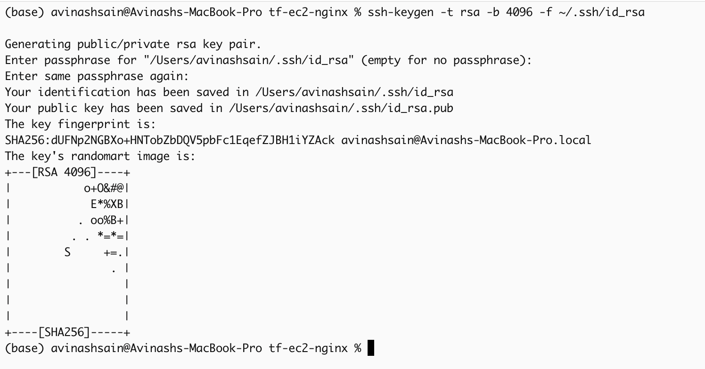
> Run the command above in your terminal and screenshot the key fingerprint and randomart image.

```
Expected output:
Generating public/private rsa key pair.
Your identification has been saved in /Users/you/.ssh/id_rsa
Your public key has been saved in /Users/you/.ssh/id_rsa.pub
The key fingerprint is: SHA256:xxxx...
```

---

### Step 2 — Configure variables

Edit `terraform/terraform.tfvars`:

```hcl
aws_region          = "us-east-1"
instance_type       = "t2.micro"
key_name            = "nginx-key"
public_key_path     = "~/.ssh/id_rsa.pub"
state_bucket_name   = "your-unique-bucket-name"   # must be globally unique
dynamodb_table_name = "tf-nginx-lock-table"
html_title          = "Terraform Nginx Server"
html_body           = "<h1>Welcome to the Terraform-managed Nginx Server on Ubuntu</h1><p>Deployed via Terraform.</p>"
```

> **Note:** S3 bucket names are globally unique across all AWS accounts. Change `state_bucket_name` if the default is already taken.

---

### Step 3 — Deploy

```bash
cd terraform
chmod +x init.sh destroy.sh
./init.sh
```

The script runs three steps automatically:

```
STEP 1 → bootstrap/        creates S3 bucket + DynamoDB table
STEP 2 → terraform init    connects main module to S3 backend
STEP 3 → terraform apply   deploys EC2 instance with Nginx
```

**Screenshot 2 — `terraform init` success**
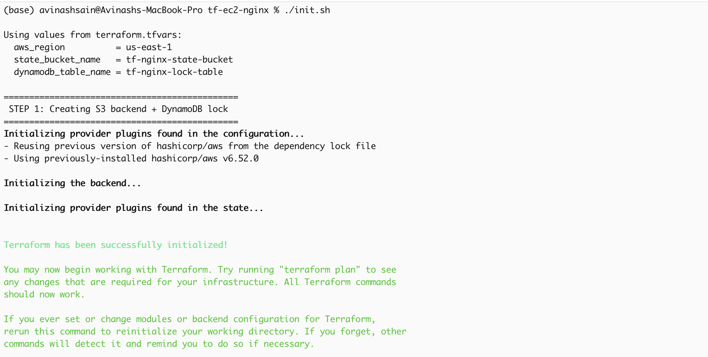
> Screenshot showing `Terraform has been successfully initialized!`

**Screenshot 3 — `terraform apply` complete**
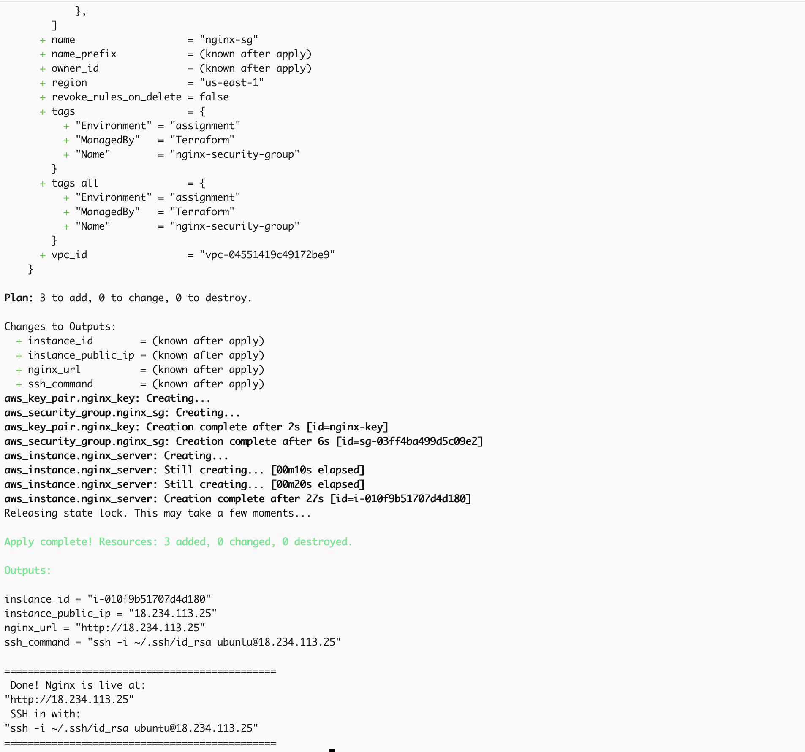
> Screenshot of the apply output showing all resources created and the outputs block:

```
Apply complete! Resources: 5 added, 0 changed, 0 destroyed.

Outputs:
instance_id        = "i-0xxxxxxxxxxxx"
instance_public_ip = "x.x.x.x"
nginx_url          = "http://x.x.x.x"
ssh_command        = "ssh -i ~/.ssh/id_rsa ubuntu@x.x.x.x"
```

---

### Step 4 — Verify Nginx in browser

Open the `nginx_url` from the outputs in your browser.

**Screenshot 4 — Nginx running in browser**
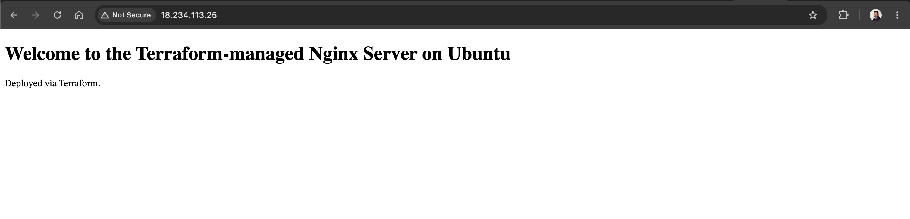
> Open `http://<instance_public_ip>` in your browser and screenshot the page showing:

```
Welcome to the Terraform-managed Nginx Server on Ubuntu
Deployed via Terraform.
```

---

### Step 5 — Verify via terminal

```bash
curl http://<instance_public_ip>
```

**Screenshot 5 — curl response**
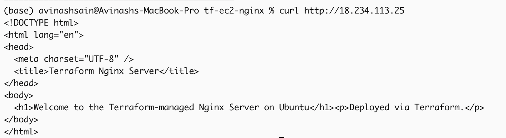
> Screenshot of the terminal showing the full HTML response from `curl`.

---

### Step 6 — SSH into the instance

```bash
ssh -i ~/.ssh/id_rsa ubuntu@<instance_public_ip>
```

Once inside, verify Nginx is active:

```bash
systemctl status nginx
```

**Screenshot 6 — SSH session + Nginx status**
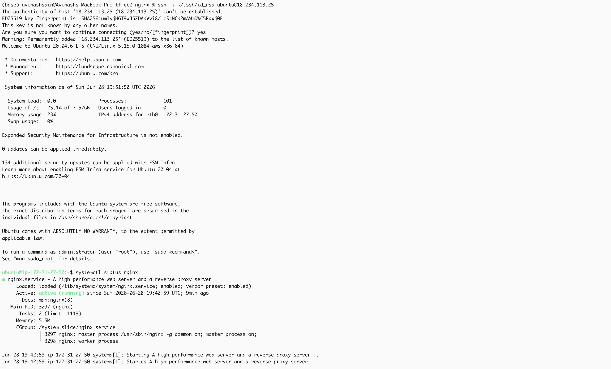
> Screenshot showing:
> - Successful SSH login (`ubuntu@ip-xxx-xxx-xxx-xxx`)
> - `systemctl status nginx` output with `active (running)` in green

---

### Step 7 — AWS Console verification

Log into the [AWS Console](https://console.aws.amazon.com) and verify each resource:

**Screenshot 7 — EC2 instance in AWS Console**
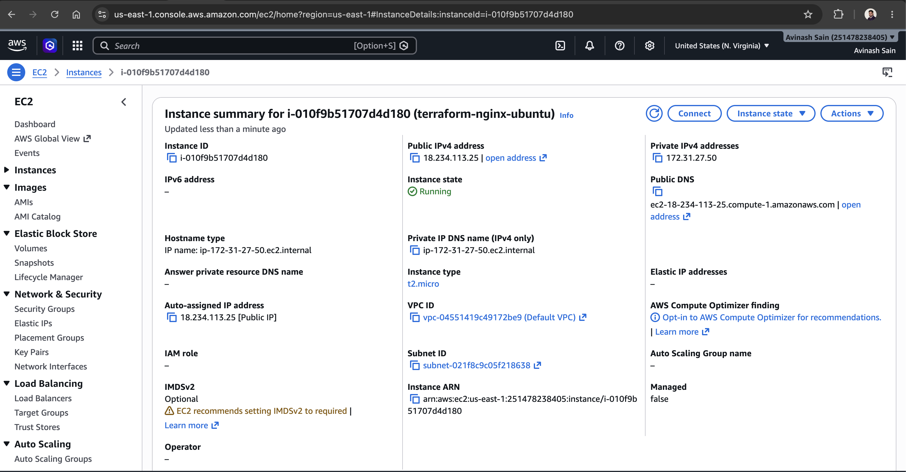
> Navigate to **EC2 → Instances** and screenshot the instance in `Running` state with the correct public IP.

**Screenshot 8 — Security Group rules**
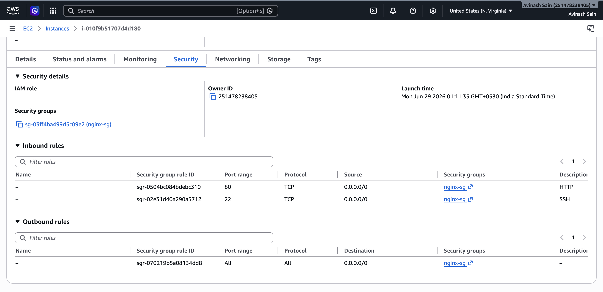
> Navigate to **EC2 → Security Groups → nginx-sg → Inbound rules** and screenshot port 22 and port 80 rules.

**Screenshot 9 — S3 bucket in AWS Console**
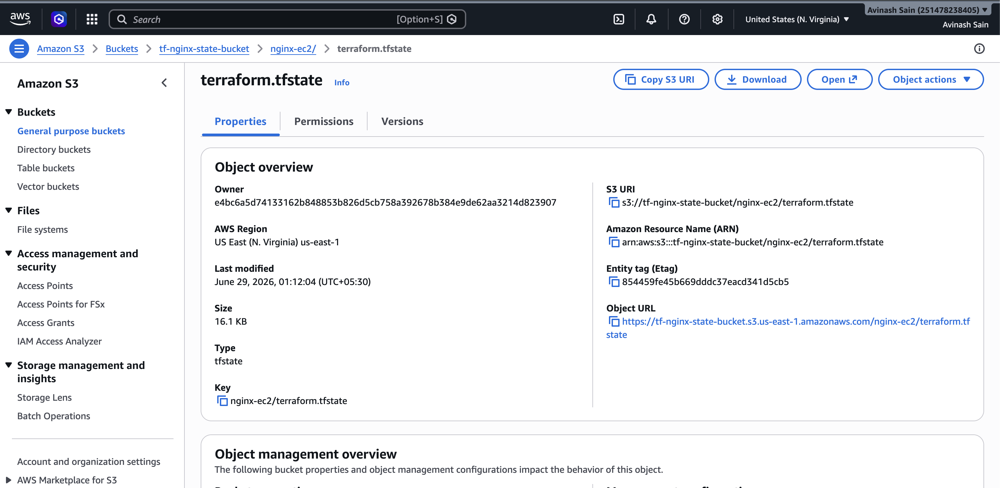
> Navigate to **S3** and screenshot `tf-nginx-state-bucket` with the `nginx-ec2/terraform.tfstate` object inside.

**Screenshot 10 — DynamoDB table in AWS Console**
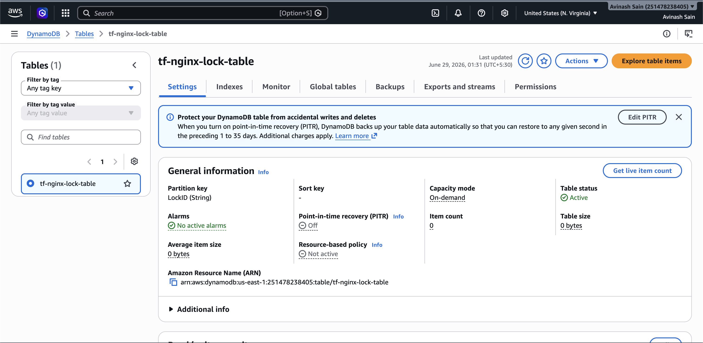
> Navigate to **DynamoDB → Tables** and screenshot `tf-nginx-lock-table` with `LockID` as the partition key.

---

### Step 8 — Destroy all resources

```bash
./destroy.sh
```

```
STEP 1 → terraform init -reconfigure   reconnects to S3 backend
STEP 2 → terraform destroy             removes EC2, security group, key pair
STEP 3 → bootstrap/ destroy            removes S3 bucket + DynamoDB table
```

**Screenshot 11 — `terraform destroy` complete**
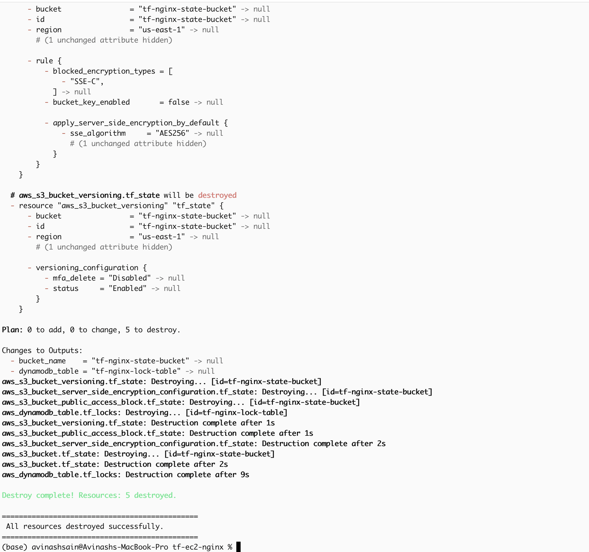
> Screenshot showing `Destroy complete! Resources: X destroyed.`

---

## Remote State & Locking

| Feature | Implementation |
|---|---|
| Remote state storage | S3 bucket with versioning + AES256 encryption |
| State locking | DynamoDB table with `LockID` partition key |
| Public access | Fully blocked on the S3 bucket |
| Concurrent protection | Lock acquired on `apply`/`destroy`, released on completion |

The `bootstrap/` module creates the S3 bucket and DynamoDB table first using local state, then `init.sh` initialises the main module pointing at that bucket — no manual two-step process needed.

---

## How `user_data.sh` Works

The EC2 instance runs `user_data.sh` on first boot via cloud-init. Terraform renders it as a template using `templatefile()`, injecting the HTML title and body from variables:

```bash
# Installs and starts Nginx
apt-get update -y && apt-get upgrade -y
apt-get install -y nginx
systemctl enable nginx && systemctl start nginx

# Writes custom HTML page
cat > /var/www/html/index.html <<HTML
  <title>${html_content_title}</title>
  <body>${html_content_body}</body>
HTML
```

---

## Variable Reference

| Variable | Default | Description |
|---|---|---|
| `aws_region` | `us-east-1` | AWS region to deploy into |
| `instance_type` | `t2.micro` | EC2 instance type |
| `key_name` | `nginx-key` | Name for the AWS key pair resource |
| `public_key_path` | `~/.ssh/id_rsa.pub` | Path to your local RSA public key |
| `state_bucket_name` | `tf-nginx-state-bucket` | S3 bucket name (must be globally unique) |
| `dynamodb_table_name` | `tf-nginx-lock-table` | DynamoDB table name for state locking |
| `html_title` | `Terraform Nginx Server` | Browser tab title for the Nginx page |
| `html_body` | `<h1>Welcome...</h1>` | HTML body content for the Nginx index page |

---

## Output Reference

| Output | Description |
|---|---|
| `instance_id` | EC2 instance ID |
| `instance_public_ip` | Public IP address of the instance |
| `nginx_url` | Full HTTP URL to access the Nginx server |
| `ssh_command` | Ready-to-run SSH command |

---

## Important Notes

- All resources are tagged with `Name`, `Environment = "assignment"`, and `ManagedBy = "Terraform"`
- No separate VPC, subnet, or internet gateway is created (as per assignment requirements)
- `*.tfstate`, `.terraform/`, and `*.pem` files are excluded from Git via `.gitignore`
- Never commit `~/.ssh/id_rsa` (private key) to version control
- Add your screenshots to the `screenshots/` folder before pushing to Git

---

> **Assignment:** EC2 Nginx Deployment with Terraform
> **Author:** Avinash Sain  
> **GitHub:** https://github.com/Avinashsain/tf-ec2-nginx